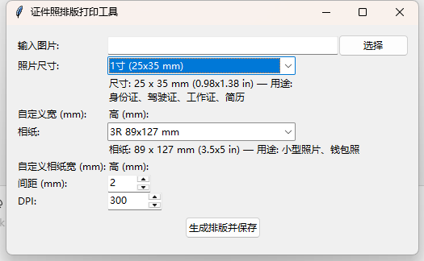

# photo-tool

一个免费开源的本地证件照排版打印工具。它可以将单张照片自动裁剪、缩放并按证件照尺寸重复排列到标准相纸上，生成可直接打印的 JPEG 排版图。Windows 用户还可直接使用 `dist` 目录中的可执行文件。



## 主要功能

- 自动裁剪和等比缩放：将原图按目标证件照比例裁剪，然后高质量缩放到指定尺寸
- 多种证件照规格：支持 1寸、2寸、35x45mm、51x51mm 等常见规格
- 支持自定义尺寸：可输入自定义照片尺寸和纸张尺寸，满足特殊打印需求
- 自动排版布局：根据纸张大小自动计算最大列数和行数，并将照片居中排列
- 可调间距：默认 2mm 间距，可在 GUI 中自由调整
- 输出高分辨率 JPEG：支持指定 DPI，适合打印输出
- 一键 GUI 运行：基于 `tkinter` 的图形界面启动器 `photo_tool_gui.py`

## 运行示例

以下是一张原图与 1 寸排版输出效果的对比：

| 原图 | 1寸排版输出 |
|------|-------------|
|  |  |

## 适用场景

- 证件照、签证照、护照照排版
- 个人照片打印、钱包照、证件照打印
- 需要本地处理，不上传云端的安全场景
- 希望直接用 `exe` 运行的 Windows 用户

## 快速开始

1. 安装依赖：

```bash
pip install -r requirements.txt
```

2. 运行 GUI：

```bash
python photo_tool_gui.py
```

3. 选择输入照片、照片尺寸、相纸尺寸、间距和 DPI，点击"生成排版并保存"。

4. 输出文件保存在输入图片相同目录，命名格式为 `原文件名_尺寸标签.jpg`。

> 已打包的 Windows 可执行文件建议放在 `dist/` 目录，用户下载后可直接双击运行。

## 目录说明

- `photo_tool.py`：核心排版逻辑，负责裁剪、缩放、排布与输出
- `photo_tool_gui.py`：`tkinter` 图形界面，方便选择尺寸和生成结果
- `requirements.txt`：依赖列表，当前仅需要 `Pillow`
- `image/`：示例图片（主界面截图、测试原图、排版效果图）
- `dist/`：推荐放置打包后的可执行文件，例如 `photo_tool_gui.exe`

## 支持的尺寸

### 常见照片尺寸

- 1寸：25 × 35 mm
- 小2寸：33 × 48 mm
- 2寸：35 × 49 mm
- 大2寸：35 × 53 mm
- 3寸：55 × 84 mm
- 35 × 45 mm：日本签证、申根签证、英国签证
- 35 × 50 mm：加拿大签证
- 51 × 51 mm：美国签证/绿卡（2×2 英寸）

### 常见纸张尺寸

- 6寸相纸：102 × 152 mm
- 4R：102 × 152 mm
- A4：210 × 297 mm
- 自定义纸张尺寸：可输入任意宽高

## 打包为可执行文件

推荐使用 PyInstaller 生成 Windows 可执行文件：

```bash
pip install pyinstaller
pyinstaller --onefile --windowed photo_tool_gui.py
```

生成后，可将 `dist/photo_tool_gui.exe` 直接分享给 Windows 用户，免安装 Python 环境。

## 运行示例

选择输入图片后，默认流程为：

1. 读取照片
2. 按目标照片尺寸计算裁剪比例
3. 对原图进行居中裁剪并缩放
4. 根据纸张和间距计算行列数
5. 将照片按网格居中排列到白色背景画布
6. 保存为高质量 JPEG 输出

## 免责声明

本工具仅做排版和打印辅助，不替代专业证件照拍摄标准。请根据目标用途确认背景色、头部比例和拍摄要求。

---
